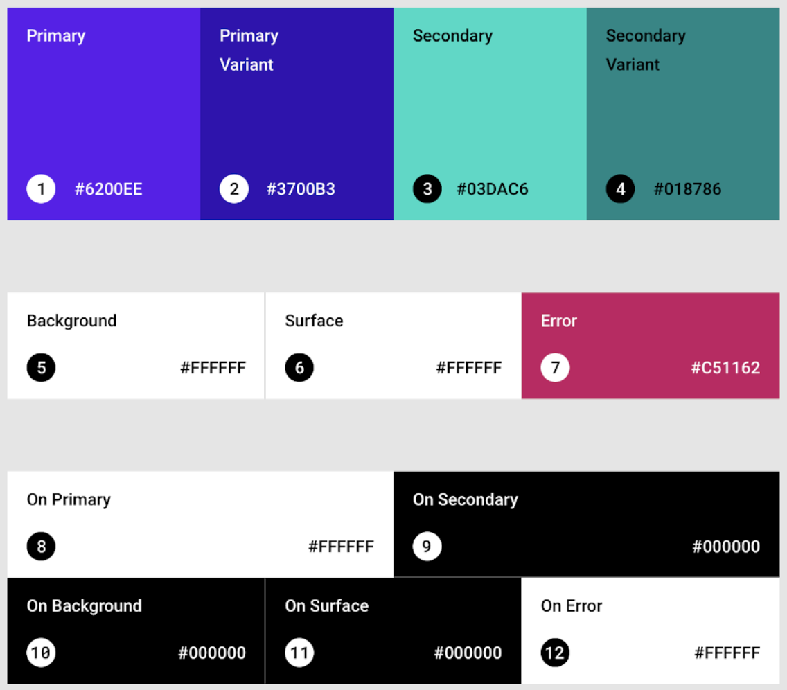
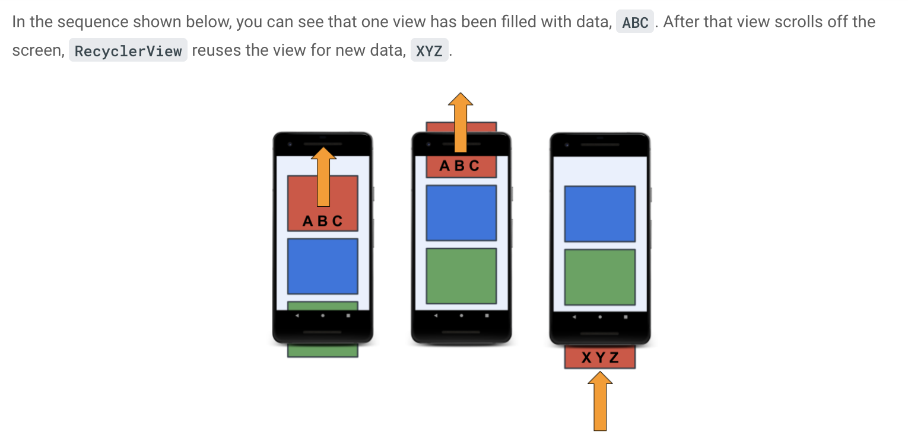
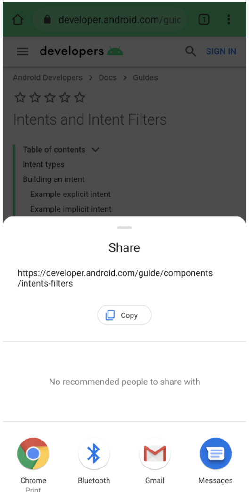
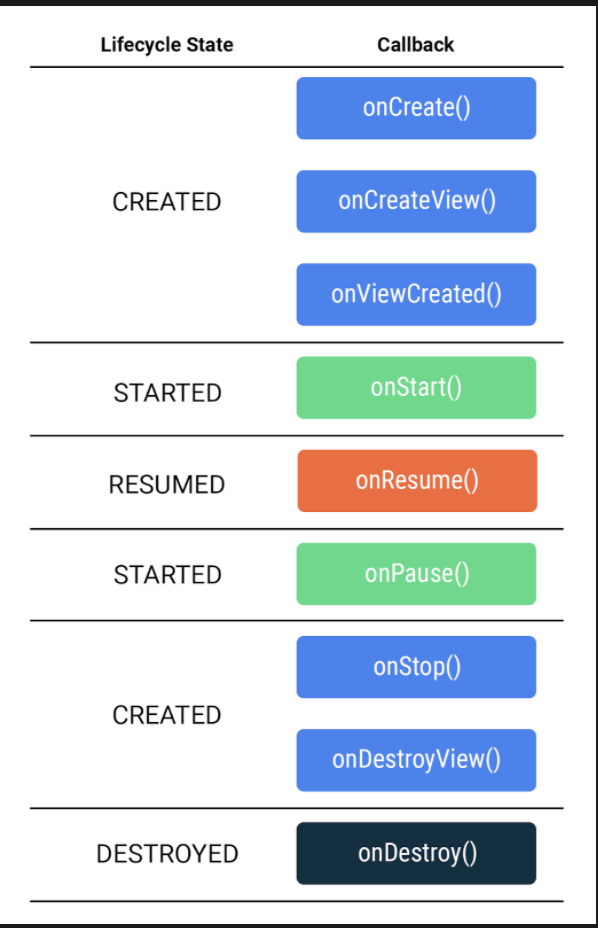
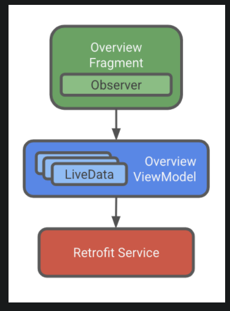
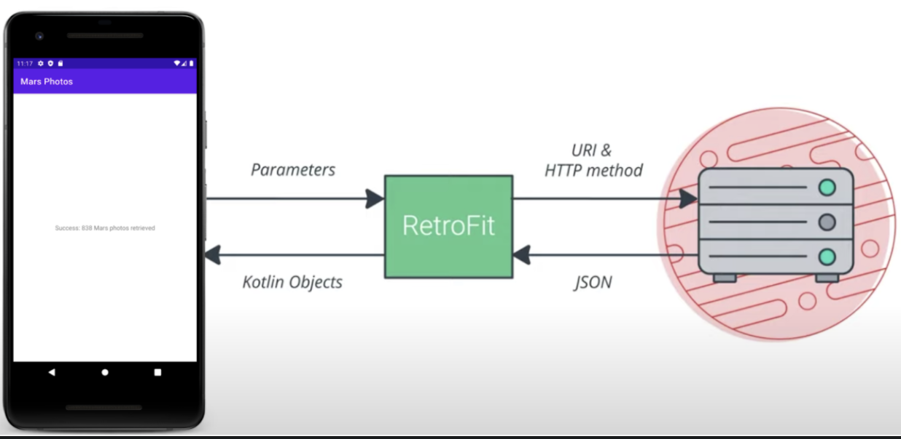

# Google Android Code Labs

[Link](https://developer.android.com/courses/android-basics-kotlin/course)

## Unit 1: Kotlin Basics for Android 

### Part 4: Dice Roll App 

#### Make an Activity:
**Activity**: An Activity provides the window in which the app draws the UI

To make an activity: 
```kotlin

class MyActivity: AppCompatActivity() {
    // in kotlin apps you have a `main()` function that is called on load 
    // in android apps, the `onCreate()` function of the activity is called on load 
    override fun onCreate(savedInstanceState: Bundle?) {
        super.onCreate(savedInstanceState)
        setContentView(R.layout.activity_main) // sets the layout of the activity 
    }
} 
```

#### Resources
Each item of the XML layout may have a resource ID attached to it which serves as the unique identifier for that ID.
Android automatically assigns ID numbers to the resources in your app and uses those (instead of the text id you see). 

Note: Kotlin doesn't copy entire objects when variables are assigned. Instead, it saves a reference to the object. 

Kotlin Android Style Guide: https://developer.android.com/kotlin/style-guide?authuser=1 

Note: image resources are known as "drawables"

## Unit 2: Layouts

### Part 1: Get User Input in an App

Class hierarchy -- for the most part in kotlin/java (android) development, classes are often extensions of other classes.

For example, in the dialog components you have used, those classes were an extension of an alert class that set up all different types of popups. 

The following terminology is associate with class hierarchy:

* **Class hierarchy**: An arrangement where classes are organized in a hierarchy of parents and children. Hierarchy diagrams are usually drawn with the parents shown above children.
* **Child** or **subclass**: Any class that is below another class in the hierarchy.
* **Parent** or **superclass** or **base class**: Any class with one or more child classes.
* **Root** or **top-level class**:  The class at the top (or root) of the class hierarchy.
* **Inheritance**: When a child class includes (or inherits) all the properties and methods of its parent class. This allows you to share and reuse code, which makes programs easier to understand and maintain.

Children inherit all properties of their parents but can have additional unique properties. In this way, child are **more specific** than their parent classes.
For example, a View is a parent class of both a TextView and ImageView. A TextView could have children such as a button or editText field. 

Codelab: See [Dwelling.kt](https://developer.android.com/codelabs/basic-android-kotlin-training-classes-and-inheritance?authuser=1&continue=https%3A%2F%2Fdeveloper.android.com%2Fcourses%2Fpathways%2Fandroid-basics-kotlin-unit-2-pathway-1%3Fauthuser%3D1%23codelab-https%3A%2F%2Fdeveloper.android.com%2Fcodelabs%2Fbasic-android-kotlin-training-classes-and-inheritance#2) 

**Abstract Class**: An abstract class is a class that cannot be fully instantiated because it is not fully implemented; think of it as a sketch. You use a sketch (abstract class) to create a blueprint (actual class) from which you build the actual object instance. 

It is beneficial to make a superclass to contain all common properties/functions of a subclass. If ALL of these shared values are not known, make the class abstract. 

When you declare abstract functions and variables, it's like a promise you will give them values and implementations later".
To do this use "override".

```kotlin

abstract class Park {
    abstract val name: String 
    abstract val length: Number
    abstract val width: Number
    abstract fun getParkArea(): Number
}

class NationalMall: Park() {
    override val name = "The National Mall"
    override val length = 800
    override val width = 500
    override fun getParkArea(): Number{
        return length * width
    }
}
```
[Learn more](https://developer.android.com/codelabs/basic-android-kotlin-training-classes-and-inheritance?authuser=1&continue=https%3A%2F%2Fdeveloper.android.com%2Fcourses%2Fpathways%2Fandroid-basics-kotlin-unit-2-pathway-1%3Fauthuser%3D1%23codelab-https%3A%2F%2Fdeveloper.android.com%2Fcodelabs%2Fbasic-android-kotlin-training-classes-and-inheritance#7)

#### [Create XML Layouts](https://developer.android.com/codelabs/basic-android-kotlin-training-xml-layouts?authuser=1&continue=https%3A%2F%2Fdeveloper.android.com%2Fcourses%2Fpathways%2Fandroid-basics-kotlin-unit-2-pathway-1%3Fauthuser%3D1%23codelab-https%3A%2F%2Fdeveloper.android.com%2Fcodelabs%2Fbasic-android-kotlin-training-xml-layouts#0)

**Android JetPack** is a suite of libraries to help developers follow best practices, reduce boilerplate code, and write code that works consistently across Android versions and devices so that developers can focus on the code they care about.

Android Jetpack elements are imported with `androidx` in their name. XML elements will also start with this (ex `androidx.ConstraintLayout`)

##### High Level Attributes: 
You will notice some of the following attributes on certain components, especially those a the root of the XML file or app activity. 
```xml
<androidx.constraintlayout.widget.ConstraintLayout 
        xmlns:android="http://schemas.android.com/apk/res/android"
        xmlns:app="http://schemas.android.com/apk/res-auto"
        xmlns:tools="http://schemas.android.com/tools"
        android:layout_width="match_parent"
        android:layout_height="match_parent"
        tools:context=".MainActivity" >
    
<!-- Add other widgets here -->
    
</androidx.constraintlayout.widget.ConstraintLayout>
```
Attributes start with a *namespace* that tells the computer to what those attributes belong to. 
For example, `xmlns` is the XML namespace, while `android` is the android namespace. All attributes associated with XML files will start with `xmlns`, while all android system attributes will start with `android`. Another common attribute is `tool` which refers to the AS/tooling only.

These namespaces serve two general purposes: 
1. To distinguish between two elements that have the same name 
   * ex: `tools:text` and `android:text`
    
2. To group elements relating to a common idea together.


#### Constraint Layout Note! 
Note: you can not use `match_parent` in a constraint layout. Instead you need to use `0dp`. 

#### Reformat the XML
Android Studio provides various tools to tidy up your code and make sure it follows recommended coding conventions.

1. In `activity_main.xml`, choose Edit > Select All.
Choose Code > Reformat Code.

2. This will make sure the indenting is consistent, and it may reorder some of the XML of UI elements to group things, for example, putting all the android: attributes of one element together.


#### Gradle 

What's Gradle? 

Gradle is the automated build system used by Android Studio. Whenever you change code, add a resource, or make other changes to your app, Gradle figures out what has changed and takes the necessary steps to rebuild your app. It also installs your app in the emulator or physical device and controls its execution.

#### View Binding
One way to access elements of a view is via `findViewById()`. This method let's you define a view, then access the view elements like so: 
```kotlin
// In the Activity 

class MainActivity : AppCompatActivity() {
    override fun onCreate(savedInstanceState: Bundle?) {
        super.onCreate(savedInstanceState)
        setContentView(R.layout.activity_main)
        
        // get view 
        val view = findViewById(R.layout.activity_main)
        // then access elements of the view to make dynamic changes
        view.myTextView.text = "update the text"
        view.myViewBtn.setOnClickListener {
            // set a listener
        }
        
    }
}
```

HOWEVER. Using `findViewById()` can be expense, especially as you have more views. A more scalable option is to use **view binding**. 

View binding requires a little more work upfront, but is a worthy investment if your app will contain multiple views. 

### Part 2: Get User App Input -- Themes and UI Enhancements

* A **style** is set of colors, looks, decorations on a view (ex: color of text, boldness, shadows, etc)
* A **theme** is styling for the entire app, not just ONE view.

A theme consists of a variety of colors that you can use throughout the app for various elements. Themes group colors into 12 groups to apply to various attributes. 


To observe or edit the theme, go to the `theme.xml` file (app-> res -> values -> themes). To adjust the theme file, you need to define colors first in the `colors.xml`.

**DARK THEME**

To edit the theme for dark mode, change the file in res -> values-night -> `theme.xml`. *Why should you care about the dark theme?*
> Dark themes reduce the luminance emitted by device screens […]. They help improve visual ergonomics by reducing eye strain, adjusting brightness to current lighting conditions, and facilitating screen use in dark environments — all while conserving battery power [for OLED displays].

The above is from the android docs. See [here](https://medium.com/androiddevelopers/dark-theme-with-mdc-4c6fc357d956) 
for more on why and how to use dark theme. Also, check out
[this suggested practice lab](https://github.com/material-components/material-components-android-examples/blob/develop/MaterialThemeBuilder/README.md) 
for making your own material theme.

### Part 3: Display a Scrollable List 

A `List` is a collection of items with a specific order.

Kotlin has two types of lists: 
* `List`: read only; cannot be modified 
* `Mutable List`: can be modified after you create it. 

You can create a list by `listOf(1, 2, ..)` or `mutableListOf("hello", "world")`. If you want to make an empty list (esp
an empty mutable list if you are planning to add elements to it later), then you need to define the type of elements in 
the list when you declare it.  ex: `val mutList = mutableListOf<String>()`

Note: the index of a list is actually the offset of an element from the first element. For example, if you have a list like so: 
> val letters = listOf("a", "b", "c", "d"). 

Then `letters[2]` means return the element that is two spots from the first element, aka the third element. 
> letters[0] = a  // return the letter 0 elements from the first element ==> return the first element
> letters[1] = b  // return the letter 1 element from the first elemet 
> letters[2] = c  // return the letter 2 elements from the first element 
> letters[3] = d  // return the letter 3 elements from the first element 

Looping through lists: 

You can use both `while` and `for` loops to loop through items in a list. Here are some examples of unique was to use for loops:
```kotlin
// Note: Here are some other variations of what you can do with for loops, including using them with ranges with specific steps (instead of incrementing by 1 each time).

for (item in list) print(item) // Iterate over items in a list

for (item in 'b'..'g') print(item) // Range of characters in an alphabet

for (item in 1..5) print(item) // Range of numbers

for (item in 5 downTo 1) print(item) // Going backward

for (item in 3..6 step 2) print(item) // Prints: 35

// You can find more in the documentation listed at the end of this codelab.
```

`vararg`: you can use vararg when you have a method that takes in the same type of parameter n times. 
```kotlin
// ex if you have a method like so: 
class Pizza(
    val topping1: String, 
    val topping2: String,
    val topping3: String
)

// you can rewrite it like so: 
class Pizza(val toppings: List<String>)

// and even further rewrite it like:
class Pizza(vararg toppings: String)
```

Recyclerview: saves CPU by refilling containers on the screen as the user scrolls. 


_Setting Up Data_

Data in android apps is usually kept in a class contained in a package called `model`

```
project
│   README.md
│   build.gradle.kts    
|
└───app
│   └───src
|       └───main
|           | AndroidManifest.xml
│           └───java
|           |   └───com.projectname
|           |       | ProjectActivity.kt
│           |       └─── **com.projectname.model**
│           └───res
```

Data that your app is *ready to consume/render* should be stored in this package. However, sometimes you will need to 
load and process data from some data source *before* your app can render it in the format you want.  You should make a 
`Data Source` class in a `data` package that handles loading and transforming data. 

RecyclerView contains 3 parts: 
* Items held in the recyclerview 
* Adapter - takes data and prepares it for a recyclerview
* View Holder - a pool of views for the recyclerview to use and display affirmations

How to add a RecyclerView: 
1. Add the XML component in your activity in a view group
   > 
   > ```xml
   > <!-- don't use match_parent for recyclerview otherwise each item will take up the full screen -->
   >  <androidx.recyclerview.widget.RecyclerView
   >    android:id="@+id/recycler_view"
   >    android:layout_width="wrap_content"
   >    android:layout_height="match_parent"
   >    android:scrollbars="vertical"
   >    app:layoutManager="LinearLayoutManager" />
   > ```
   > The XML of a RecyclerView should have a `layoutManager`. This manager handles how to display the items (ex: linearly or a grid). Some popular ones are `GridLayoutManager`, `LinearLayoutManager`, `StaggeredGridLayoutManager`.
   > <br>
   > <br>
   > To be able to scroll on a RecyclerView, add the following field: 
   > `android:scrollbars="vertical"`
   
2. Implement an Adapter: 
> Your app needs something to take data from the source and format it so each item can be displayed on the recyclerview. 
> An **Adapter** is a design pattern that **adapts** data for this purpose. 
> The RecylcerView uses an adapter to figure out how to display data on the screen

A Note on RecyclerView Adapter and how things work: 
> When you run the app, RecyclerView uses the adapter to figure out how to display your data on screen. 
> RecyclerView asks the adapter to create a new list item view for the first data item in your list. 
> Once it has the view, it asks the adapter to provide the data to draw the item. 
> This process repeats until the RecyclerView doesn't need any more views to fill the screen. 
> If only 3 list item views fit on the screen at once, the RecyclerView only asks the adapter to prepare those 3 list item views (instead of all 10 list item views).
> Via [link](https://developer.android.com/codelabs/basic-android-kotlin-training-recyclerview-scrollable-list?authuser=1&continue=https%3A%2F%2Fdeveloper.android.com%2Fcourses%2Fpathways%2Fandroid-basics-kotlin-unit-2-pathway-3%3Fauthuser%3D1%23codelab-https%3A%2F%2Fdeveloper.android.com%2Fcodelabs%2Fbasic-android-kotlin-training-recyclerview-scrollable-list#3)

An adapter has multiple parts: 
* 2a. create an XML element for whatever item your recyclerview is holding 
* 2b. create an `ItemAdapter` class
  > ```kotlin
  > import com.example.affirmations.model.Affirmation
  > 
  > class ItemAdapter(
  >    private val context: Context, 
  >    private val dataset: List<Affirmation>
  > ) {
  > }
 * 2c.  Create a view holder:
> You can add this in the adapter class (aka nested class) bc it will only be used by the adapter:
> ```kotlin
> class ItemAdapter(
>    private val context: Context,
>    private val data: List<Affirmation>
>   ) {
> 
>       @param view - view/layout you are going to insert into the recyclervie
>     class ItemViewHolder(private val view: View)
>       // sometimes this will just be of type View and other times it might be view binding 
>       // type of the view you want to add to your recyclerview 
> }

The view holder "holds" the views (list items) in memory and the views get recycled. It holds views and gets ready to add the next one and so forth

* 2d. Connect the view holder and adapter. 
    * Make your adapter class extend the `RecyclerView.Adapter` class 
    * List your view holder class as the view holder type
    * Implement the abstract methods associated with extending `RecyclerView.Adapter`: 
        * `getItemCount()`: returns size of your data set
        * `onCreateViewHolder()`: called by the layout manager to create new ViewHolders when there are no existing view holders to be used.  
        * `onBindViewHolder()`: called by layout manager to replace the contents of a list item view. 
          
Note: `onCreateViewHolder` will use a layout inflater. Layout Inflater

* 2e. Add the set up the recyclerview in your activity: 
```kotlin
class MainActivity : AppCompatActivity() {
    override fun onCreate(savedInstanceState: Bundle?) {
        super.onCreate(savedInstanceState)
        setContentView(R.layout.activity_main)

        val data = DataSource().loadData()
        val myRecyclerView = findViewById<RecyclerView>(R.id.recyclerview)
        myRecyclerView.adapter = ItemAdapter(this, data)
    }
}
```

-------------------------------------------------------------
## Unit 3: Navigation: Navigate Between Screens

### Part 1: Collections in Kotlin
**Collections:** are a group of related items, like a list of words, or a set of employee records. The collection can be ordered or unordered. One type of collection is a list
*list*: ordered set of items but the items do not have to be unique 

Collections can be *mutable* or *immutable*. 

**Mutable:** able to be changed <br>
**Immutable:** unable to be changed. The list set at the definition is what it remain. 

You can create a list and run methods on it: 
```kotlin
val myList = listOf("S", "A", "R", "A", "H", "M", "U", "R", "R", "A" "Y")
println(myList.distinct())  // ["S", "A", "R", "H", "M", "U", "Y"]
println("There are ${myList.distinct().size} unique letters in my name")
```
<hr>

**Sets**: a set is a group of related items but unlike a list there can not be any duplicates. 
```kotlin
val mySet = myList.toSet()
println("my set: $mySet")
```

Sets are equal if they contain the same elements. 
```kotlin
val set1 = setOf(1, 2, 3)
val set2 = mutableSetOf(3, 2, 1)
println("$set1 == $set2 : ${set1 == set2}") // [1, 2, 3] == [3, 2, 1] : true
```

The most common function to preform on a set is checking if an item is in the set. You can do this with the `contains` method. 
```kotlin
println(mySet.contains("S")) // true
```
You can also find the intersection or union of two sets (just like the mathematical operations)

<hr> 

**Maps:**
A map, or dictionary, is another type of collection that consists of a set of *key-value pairs*, where keys are unique and allow you to look up certain values. Each key maps to exactly one value, but values can be duplicates. Values can be string, numbers, objects, or other collections. 
```kotlin
// map people to their sun moon and rising signs
val peopleToSigns = mutableMapOf<String, List<String>>(
    "Sarah" to listOf<String>("Scorpio", "Pisces", "Aquarius"), 
    "Sharon" to listOf<String>("Libra", "Aquarius", "Pisces"),
    "Rachel" to listOf<String>("Pisces", "Capricorn", "Leo")
)
println(peopleToSigns)
// {Sarah=[Scorpio, Pisces, Aquarius], Sharon=[Libra, Aquarius, Pisces], Rachel=[Pisces, Capricorn, Leo]}

// you can add new items like so:
peopleToSigns.put("Lauren", listOf("Leo", "Gemini", "Aries"))

// you can get specific people like so:
peopleToSigns["Sharon"]
```

There are a lot of commands you can run on collections such as `map`, `filter`, `forEach`, `sort` and more. 


Recall Lambdas and Higher Order Functions: 

* **Lambda**: A function with no name. 
   * ex: `peopleAges.forEach { print("${it.key} is ${it.value}") }`
* **Higher Order Function**: passing a function (a lambda) to another function, or returning a function from another function. 
  * ex: `map, forEach, filter`


### Part 2: Activities and Intents:
We'll build an app with multiple activities and navigate between them using intents. 

#### Intents: 
An *intent* is an object representing some action to be performed, or a set of instructions. The most common intent is to launch an activity.
Another example is sending users to another app. There are two types of intents: 

1. Explicit: highly specific, where you know the activity to be launched (often a screen in your app)
2. Implicit: more abstract, you tell the system the type of action (ex: openning a link, composing an email, making a phone call) and the system figures out how to fulfill the request.   

Intents, both implicit and explicit, describe the request and not the actual result. 

Explicit intents are for navigation to activities in your app. Implicit intents might be used for a screen like this that will rely on other apps: 


##### You can pass data with your intent.
Recall an intent is just a set of instructions. There is no instance of you destination (activity or app) yet. You can send data but telling the intent to "put (an) extra (piece of data)" on the instructions. 
```kotlin
val intent = Intent(context, MyIntentActivity::class.java)
// you can put all kinds of variables on the intent
intent.putExtra("mydata", "testData")
intent.putExtra("year", 2021)
intent.putExtra("testArray", arrayOf(true, false))
context.startActivity(intent) // makes our actual instance of the new activity
```
To access this data in your new intent you just make a call to the bundle of the intent: 
```kotlin
val data = intent.getStringExtra("mydata")
// or 
val data = intent?.extras.getString("mydata")
// Note: in either way, data will be nullable so you need to handle the case it is `null`
```

#### Menus 
Menus are ways to add navigation or app element related actions in a place easily accessible to the user. 
To add a menu, define the XML of the menu in `res/menu` directory, then inflate the menu into the view in your activity (by overriding the `onCreateOptionsMenu` method)

1. Define menu XML: 
```xml
<!-- define this in res/menu directory-->
        <?xml version="1.0" encoding="utf-8"?>
<menu xmlns:android="http://schemas.android.com/apk/res/android"
      xmlns:app="http://schemas.android.com/apk/res-auto">
    <item android:id="@+id/action_switch_layout"
          android:title="@string/action_switch_layout"
          android:icon="@drawable/ic_baseline_view_list_24"
          app:showAsAction="always" />
</menu>
```
> Elements on a menu are called `items`. Menus can have multiple items. 

2. Inflate menu in activity: 
```kotlin
override fun onCreateOptionsMenu(menu: Menu?): Boolean {
   menuInflater.inflate(R.menu.layout_menu, menu)

   val layoutButton = menu?.findItem(R.id.action_switch_layout)
    // you can set these elements in the XML or dynamically here
   menu.setIcon = ContextCompat.getDrawable(this, R.drawable.ic_icon)

   return true
}
```

3. Handle Click events
```kotlin
// menu item's click events can be handled by overiding the `onOptionsItemSelected` method and using a when block handling what happens WHEN each item is clicked
override fun onOptionsItemSelected(item: MenuItem): Boolean {
    // Handle item selection
    return when (item.itemId) {
        R.id.new_game -> {
            newGame()
            true
        }
        R.id.help -> {
            showHelp()
            true
        }
        else -> super.onOptionsItemSelected(item)
    }
}
```

### Part 4: Stages of the Activity Lifecycle

#### Using Logcat 
You can add logs to see what's happening in logcat like so: 
```kotlin
log.d("MainActivity", "onCreate called")
// you can also predefine tags and pass them in 
val TAG = "MainActivity"
log.d(TAG, "onCreate called")
```
Then, you can search logcat for these tags. Searching `D/` will bring up all debug tags aka tags made with `log.d`. Other log types include: 

| log function | log type | 
| --- | ---| 
| `log.d()` | debug logs | 
| `log.i()` | informational messages | 
| `log.e()` | errors | 
| `log.w()` | warnings | 
| `log.v()` | verbose messages | 

#### Lifecycle 
The order of events that can occur for an android application. There are approximately 5 different lifecycle states 
```
 -----------------------------
|           Resumed           | // activity visible and focuses 
 -----------------------------
           ^                |
  onResume |        onPause |
           |                v
 -----------------------------
|           Started           | // activity visible 
 -----------------------------
           ^                |
   onStart |        onStop  |
onRestart* |                v
 ------------------------------
|           Created            |
 ------------------------------
           ^                |
  onCreate |      onDestroy |
           |                v
 -------------    -------------
| Initialized |  |  Destroyed  |
 -------------    -------------
 ```

It's important to know when your app will be in a certain state or lifecycle method. For example, let's define some user interactions and detail what lifecycle method your app is in in each moment. 

| User Interaction | Method Called | Starting State | Ending State |
| --- | --- | --- | --- |
| User opens your app | onCreate | Initialized |  Create |
|                     | onStart  | Created | Started |
|                     | onResume | Started | Resumed |
|  | | |   |         
| User hits home button | onPause | Resumed |  Started |
|                       | onStop | Started |  Created |
|  | | |   | 
| User reopens app | onRestart | Created |  Started | 
|                  | onResume | Started |  Resumed |
|  | | |   | 
| User kills the app | onPause | Resumed |  Started |
|                   | onStop | Started |  Created |
|                   | onDestroy | Created |  Destroyed |

As you can see from the table above, applications do not often stay in the `created` or `started` states. 
Other methods are usually immediately invoked in these states. One example of a user staying in `started` would be if 
some type of bottom sheet has been launched over the main activity. In this case, the main activity is still visible but not in focus.
 
Order in which methods are called: 
1. OnCreate & 2. onStart & 3. onResume  (Initialized -> Created --> Started --> Resumed)
4. onPause & 5. onStop (Resumed --> Started --> Created)
6. onRestart & 7. onResume (Created -> Started -> Resumed)
8. onPause & 9. onStop & 10. onDestory (Resumed --> Started --> Created --> Destroy)

Another valid flow is: 
1. onCreate & 2. onStart & 3. onResume (happen simultaneously)
3. onPause  & 4. onStop
5. onDestroy
this would happen if a user opens the app (create, start, resume), hits the home button (pause, stop), then later kills the app without re-entering it (destory).

Questions: 
1. Will onStart always be called immediately after onCreate? 
    - yes 
2. Will onStop always be called immediately after onPause? 
    a. is there any decernable UI change between these states?
        - Sometimes. The UI is only decrenable between the `Started` and `Resumed` states in the concept of a "multi-window" mode, 
          when uses might have mutliple activities on their screen at one time. One example of this would be split screen 
          on an android device, or launching a bottom sheet for sharing a link out.  
        - This is why the difference between Resume & Start is that in resume state, the activity has *focus* so a user has "clicked" on that activity for example.

#### Lifecycle Methods
* `onCreate()` to create the app.
* `onStart()` to start it and make it visible on the screen.
* `onResume()` to give the activity focus and make it ready for the user to interact with it.
    * Despite the name, the onResume() method is called at start up, even if there is nothing to resume.
* `onPause()` caused when the activity loses focus (ex: link sharing bottom sheet is launched) 
    * Keep the code in here light, this method runs quickly and also blocks other things from displaying
    * You should **not** save application or user data, make network calls, or execute database transactions here as they might not complete before the method does
* `onStop` -- app is no longer visible on screen, but is not fully shut down (running in background, can see in recent apps)
* `onDestroy()` - the activity is fully shut down and resources can be garbage collected

Note: `onCreate` and `onDestroy` are only called ONCE in your app's activity instance's lifetime. `onCreate` to initialize the instance and `onDestroy` to clean up resources used by your app. 

#### Navigating Between Activities 
Activities will sometimes start other activities. This is a common navigation occurance, or app flow. Sometimes, 
you might `startActivityForResult` and listen for that result in your first activity. It's important to note that 
the transition from one activity to another causes each activities' lifecycles to overlap. 
This process is well defined, for example let's say Activity A is responsible for starting Activity B, then:

 1. **Activity A**'s `onPause()` method executes.
 2. **Activity B**'s `onCreate()`, `onStart()`, and `onResume()` methods execute in sequence. (Activity B now has user focus.)
 3. Then, if **Activity A** is no longer visible on screen, its `onStop()` method executes.

#### Notes on Saved Instance State & Configuration Changes: 

*Configuration Change*: 
> A configuration change happens when the state of the device changes so radically that the easiest way for the system to resolve the change is to completely shut down and rebuild the activity.
> 
> Ex: user changes device language (layout size might need to change to accommodate new text size), device is rotated, etc. 

If you were to open an android app with logs at each activity life cycle method, and then rotate the device you would expect to see the following logs: 
```
2020-10-16 11:03:09.618 23206-23206/com.example.android.dessertclicker D/MainActivity: onCreate Called
2020-10-16 11:03:09.806 23206-23206/com.example.android.dessertclicker D/MainActivity: onStart Called
2020-10-16 11:03:09.808 23206-23206/com.example.android.dessertclicker D/MainActivity: onResume Called
2020-10-16 11:03:24.488 23206-23206/com.example.android.dessertclicker D/MainActivity: onPause Called
2020-10-16 11:03:24.490 23206-23206/com.example.android.dessertclicker D/MainActivity: onStop Called
2020-10-16 11:03:24.493 23206-23206/com.example.android.dessertclicker D/MainActivity: onDestroy Called
2020-10-16 11:03:24.520 23206-23206/com.example.android.dessertclicker D/MainActivity: onCreate Called
2020-10-16 11:03:24.569 23206-23206/com.example.android.dessertclicker D/MainActivity: onStart Called
```
Meaning as the device is rotated the system shuts down and then creates a new activity. This will cause the activity to start back up with default values for any variables stored there. 
To avoid data mis-matches in this case, you should save data to a bundle known as the `InstanceState`. You can do this with the method `onSaveInstanceState()`

*Save Instance Data*
`onSaveInstanceState()` can be thought of as safety measure for important app data that needs to persist despite configuration changes. This method is called after your activity has been stopped. (onPause --> onStop --> onSavedInstanceState)

*Restoring Data*
The app's data can be restored in either `onCreate()` or via `onRestoreInstanceState()`

1. In `onCreate` looks like this: 
```kotlin
override fun onCreate(savedInstanceState: Bundle?) {
    if (savedInstanceState != null) {
        // set the values you need to set from the bundle or for other non-initializing activity things
    }
}
```

2. `onRestoreInstanceState()` is it's own method that runs after the `onStart` phase of the lifecycle. To use it, just override it like all other lifecycle methods.
    * it's only called when recreating an activity, not if onStart is called for any other reason

When to use `onCreate` vs `onRestoreInstanceState()`
* most times you will likely just use `onCreate` to restore state and check the bundle
* use `onRestoreInstanceState` if you need to do some work AFTER all the initialization has been done or to give power to subclasses to restore as they want. 


Google Docs on Intents, Lifecycle, Configuration etc:
* https://developer.android.com/reference/android/app/Activity#ActivityLifecycle
* https://developer.android.com/reference/android/app/Activity#configuration-changes
* https://developer.android.com/guide/components/activities/activity-lifecycle


## Unit 3: Navigation: 
## Section 2 Navigation Component 

### Part 1: Navigation Component Architecture
Navigation Component: A collection of libraries, a plugin, and tooling for unifying and simplyfing Android Navigation. 

Navigation Component consists of 3 pieces: 
1. Navigation Graph 
2. NavHost 
3. NavController

#### 1. Navigation Graph
The Navigation Graph is an XML resource that contains what I call, the metadata, of your app's navigation. In this file 
you will include all the screens that users can be navigated to, the connections of these screens. You can also define 
parameters (safe args) to pass between screens here and create and assign transitions for smoother navigation UI

#### 2. NavHost 
Basically a fragment window that will swap out different pieces of your navigation. 

#### 3. NavController
Manages navigation within a NavHost. Each NavHost has a cooresponding NavController. This is what actually instructs the navigation to occur (hence "controls" the navigation) 


How to add the navigation component to your app: 
1. Add the dependencies you need. 
   ```gradle
   implementation("androidx.navigation:navigation-fragment-ktx:$nav_version")
   implementation("androidx.navigation:navigation-ui-ktx:$nav_version")
   ```
2. Create a navgraph of the navigation flows between fragments / activities in your app. (Touch an XML file at `res/navigation/nav_graph.xml`)
    * Add destinations 
    * Be sure to add a default destination 
3. Add your NavHost 
    * you can define it in either the XML or in your activity 
    * if defining it in your activity, be sure to make sure it persists despite configuration changes (ex: rotation)
4. Add a NavController    
5. Define navigation events based on other user actions (ex: clicks)
```kotlin
override fun onClick(view: View) {
    val action = FragmentDirections.actionAmountFragmentToConfirmationFragment()
    view.findNavController().navigate(action)
}
```

### Gotchas with Nav Component: 
Watch out for configuration changes (ex: rotations) affecting your navigation. In the past I've seen users dropped back 
on the start destination when the device is rotated because the `navControler.setGraph` method was called in every `onCreate` 
when it should only be called once. To do this, wrap the call around a savedInstanceState check. Ex: 
```kotlin
internal class MyActivity : Activity() {
    override fun onCreate(savedInstanceState: Bundle) {
        val navHostFragment = supportFragmentManager.findFragmentById(R.id.nav_host_fragment) as NavHostFragment
        val navController = navHostFragment.navController
        
        if (savedInstanceState == null) {
            navController.setGraph(R.navigation.nav_graph)
        }
    }
}
```

### Part 2: Fragments and the Navigation Component

#### Fragment Lifecycle: 
Recall fragments are for building modular UIs. They represent a piece of code to be displayed to the user that may also handle user interactions. 
One activity may host multiple fragments at a time but each fragment must be tied to an activity. Fragments manage their own lifecycles which are similiar to activity lifecycles. 

Fragment lifecycle has the same 5 states as the activity lifecycle: `INITIALIZED`, `CREATED`, `STARTED`, `RESUMED`, `DESTROYED`
The difference between the two is the methods associated with these states, the `CREATED` state and `DESTROYED` state have some unique methods to them compared to activities.


The methods `onStart`, `onPause`, `onResume`, `onStop`, and `onDestroy` are the same as the activity cycle. 
The following methods are new or different:
* `onCreate()`: The fragment has been instantiated and is in the CREATED state. However, its corresponding view has not been created yet.
* `onCreateView()`: This method is where you inflate the layout. The fragment has entered the CREATED state.
* `onViewCreated()`: This is called after the view is created. In this method, you would typically bind specific views to properties by calling findViewById().
* `onDestroyView()`: This is called after the view is stopped. This method is called when n navigating from one fragment
  to another aka everytime the fragment is removed from the main view. In this way it's similiar to `onStop`. 
  It is different from `onDestroy` which collects the garbage of the fragment and is only called when the parent activity is also destroyed

// TODO: finish nav component notes section 2 

## Unit 3: Navigation 
## Architecture Components 

### Store Data in a ViewModel

Android Jetpack has a set of [architecture components](https://developer.android.com/topic/architecture?authuser=1) 
that help you practice best arch practices. Good architecture is robust, scalable, and flexible. 

At minimum, the recommended Android architecture has two layers: 
1. UI Layer: 
2. Data Layer: 

The UI layer should contain two components: 
1. UI controllers: Activities, Fragments -- these elements show the data to the user and handle interactions 
2. State holders (viewModels) that are responsible for holding data and presenting it to the UI, independent of configuration changes. 

By having these two pieces to the UI layer we have well organized code that consists of UI drive by data models.

**ViewModel**
> holds all business logic needed for the UI and prepares it for display. 
> Maintained during configuration changes, not destroyed like UI elements are, ensuring the data is available for the new activity/fragment instance
> It should **not** access view hierarchy (`binding` obj) or have reference to any UI elements. 

**Steps to implement a View Model**
1. Make a new file `MyViewModelClass`
2. Add reference to this view model in your UI element (Activity/Fragment)
    * do this via property delegation
   ```kotlin
      // at the top of the Activity / Fragment class:
      private val viewModel : MyViewModelClass by viewModels()
   ```
3. Add data in your viewModel 
    * assign the data via the backing property
    * Note: mutable data in the viewModel should always be private! Do not expose these fields
    
4. Add other business logic to VM that helps present and update data for the UI
    
**ViewModel Lifecycle**
* A `viewModel` is alive so long as the scope of the activity or fragment is alive 
* the `viewModel` **is not** destroyed when the activity or fragment undergoes a configuration change (ex: device rotation)
* the `viewModel` is killed when/if the activity/fragment is killed (either killing the app or calling `finish()` in the code)


## Unit 4: Network:
## Coroutines in Kotlin 

**Threads**
Threads are an abstraction for how a processor appears to handle multiple tasks at once. A thread is the smallest unit of
code that can be scheduled and run in the confines of a program. 

**Concurrency**
Allows multiple units of code to be executed seemingly out of order. Execution occurs in parallel, 
permitting more efficient use of resources. Concurrency is necessary to avoid blocking your app's UI thread. It ensures
that a long running task (ex: nerwotk request) wont' stop the execution of other things in your app. Without this, your 
app could appear unresponsive. 

Note: When multiple threads are being run concurrently, there is not predictable order in which the threads will run or complete. 

**Challenges with threads**
* Threads require a lot of resources
    * creating, switching and managing threads take up system resourses and time limiting the raw number of threads 
      that can be managed at the same time. 
* OS wants app to be responsive 
    * current phones try to update the UI 60-120 times per second (60 at min)
    * draw the UI at 60 fps -- meaning every screen update should take 16ms or less 
    * frames often get dropped -- too many dropped frames and the app could crash 
    
**Race Condition**
Multiple threads try to access the same value in memory at the same time. Can lead to random, hard to reproduce bugs that can even cause app crashes. 

Note: because of the challenges with threads, their possibility of leading to race conditions or other app performance issues, 
you should be careful (or avoid) working with threads directly. In kotlin, we can use coroutines instead to write "concurrent" code. 

### Coroutines
- much less expensive than threads
- Kotlin provided more flexible and easier way to manage concurrency
- enables multitasking but abstraction instead of working directly with threads
    * s/t on android you will need to work directly with threads
    * **when?:**
- may or may not execute 
- can store state (aka `continuations`)

TODO: Add more notes about coroutines (Jobs, state, deferred, runBlocking, async/await)


## Section 2 API Requests 

Use Retrofit -- other popular option is OkHTTP 

Code base: https://github.com/sarahmurraydev/android-basics-kotlin-mars-photos-app 
Contains: Activity, fragment, viewmodel. 

The `ViewModel` is what communicates directly with the network service layer that we will build in this code lab. 
The network service layer is made using retrofit and is what communicates with the backend 
We use `LiveData` with lifecycle aware databinding in the viewModel to cause UI updates. 



**Using Retrofit**

Retrofit is a popular, well maintained, third party library. Using libraries like these is common in android development. 
Just be sure to check the libraries github to make sure it is still being updates/ well maintained
Retrofit will "fit" in the middle of our API call between the client (android OS) and server (RESTful API). 
Retrofit will fetch the data using parameters we give it, parse the json (or other content type) response, and return a 
kotlin object to our android client: 


Steps to use:m
1. Add dependency to `build.gradle`
2. Make an API Service interface
    * use Retrofit.builder()
    * Add a converter factory for (de)serialization of response objects
    * `ScalarsConverter` is popular converter factory that supports converting to strings/other primatives
    
3. Make a call to the retrofit service in a coroutine in the viewmodel 
4. update live data tied to the ui with your API result
    
Retrofit Gotchas: 
* The call to `create()` function on a Retrofit object is expensive and the app needs only one instance of Retrofit API service. So, you expose the service to the rest of the app using object declaration.
* 

Moshi is a JSON converter commonly used with retrofit. Moshi parses the data and converts it into kotlin objects. 
To do this, Moshi needs to have a kotlin data class to store the parsed results. 
Moshi is used over GSON which is the old lib name: https://www.reddit.com/r/androiddev/comments/684flw/why_use_moshi_over_gson/

Steps to use Moshi:
1. Add dependecy to gradle file 
2. make a moshi variable of a moshi.builder 
3. use this builder as the retrofit converter factory 
4. change the API return type to a data class you made

## Unit 4: Network
## Section 3: Load and display images from the Internet

Why is displaying photos so much work on android devices? 
> Displaying a photo from a web URL might sound straightforward, but there is quite a bit of engineering to make it work well. 
> 
> The image has to be downloaded, internally stored, and decoded from its compressed format to an image that Android can use.
>
> The image should be cached to an in-memory cache, a storage-based cache, or both. 
> 
> All this has to happen in low-priority 
> background threads so the UI remains responsive. Also, for best network and CPU performance, you might want to fetch and 
> decode more than one image at once.

Coil: new library for loading images (in lieu of Picasso or Glide)


### Binding Adapters: 
Binding Adapters are annotated methods used to create custom setters for custom properties of your view. 
> Usually when you set a value in XML like `android:text="@string/my-text`, the android system automatically looks 
> for a setter with the same `text` attribute (which is `setText(string)`, a method provided by the Android Framework). 
> Similiar behavior can be customized though giving you the ability to provide a custom attribute and custom logic that 
> will be defined by the Data Binding library


Why do we need binding adapters? 
> In  react, you can write in JSX, which is a combination of both JS + HTML components. This allows you to add data values to your HTML, 
> like adding a paragraph of text or setting an image Src from a value returned from a backend API.
>
> In android, XML files exist in almost separate area of the app than the data/kotlin files that pull and update data. 
> Binding adapters serve as a bridge and act almost like that react JSX -- it lets you create XML tags to define based on your data
> or other relevant criteria 

**Section Summary:**
* The Coil library simplifies the process of managing images, such as download, buffer, decode, and cache images in your app.
* Binding adapters are extension methods that sit between a view and that view's bound data. 
  Binding adapters provide custom behavior when the data changes, for example, to call Coil to load an image from a URL into an ImageView.
* Binding adapters are extension methods annotated with the @BindingAdapter annotation.
* To display a grid of images, use a RecyclerView with a GridLayoutManager.
* To update the list of properties when it changes, use a binding adapter between the RecyclerView and the layout.


## Unit 4: Network
## Section 4: Test Network Requests

You can add API example data (for testing purposes) in your test/res directory.
To be able to access files in this resource directory, the test resource directory needs to be explicitly specified 
as a "source" directory in the build file. Add the following line:
```gradle
// to app/build.gradle: 
android {
    ...
    sourceSets {
       test.resources.srcDirs += 'src/test/res'
    }
}
```
This lets us access our resource files without having to type out the full path to the file in our code every time it 
is accessed in a test. Typing out the full path is a poor practice for testing as file paths can change between 
machines and operating systems.

**Mock**
Mocking means we are simulating the value of a piece of code. It is extremely popular practice in android testing. 
We can mock all kinds of things: classes, functions, APIs. The mock will allow us to define a return value for these items
that can then be used in our test. 

For example, we can mock that an API will return some proper JSON so that we can 
test our transformer (or data class) is properly parsing the JSON. In addition, we can mock that an API will return an error
(fail to load) to test our app's unhappy path (error state) is functioning properly

**A New Dependency**
The codelab () tells us to add the following dependencies for testing: 
```gradle
depenedencies {
    ...
    // testing
    testImplementation 'junit:junit:4.12'
    testImplementation "androidx.arch.core:core-testing:2.1.0"
    testImplementation "com.squareup.okhttp3:mockwebserver:4.9.1"
}
```

The first two you are familiar with -- basic testing packages. 
The third one is new.
This dependency lets us create a mock server. Essentially, the mock server intercepts network requests and 
reroutes them to return the mock data that we have defined!