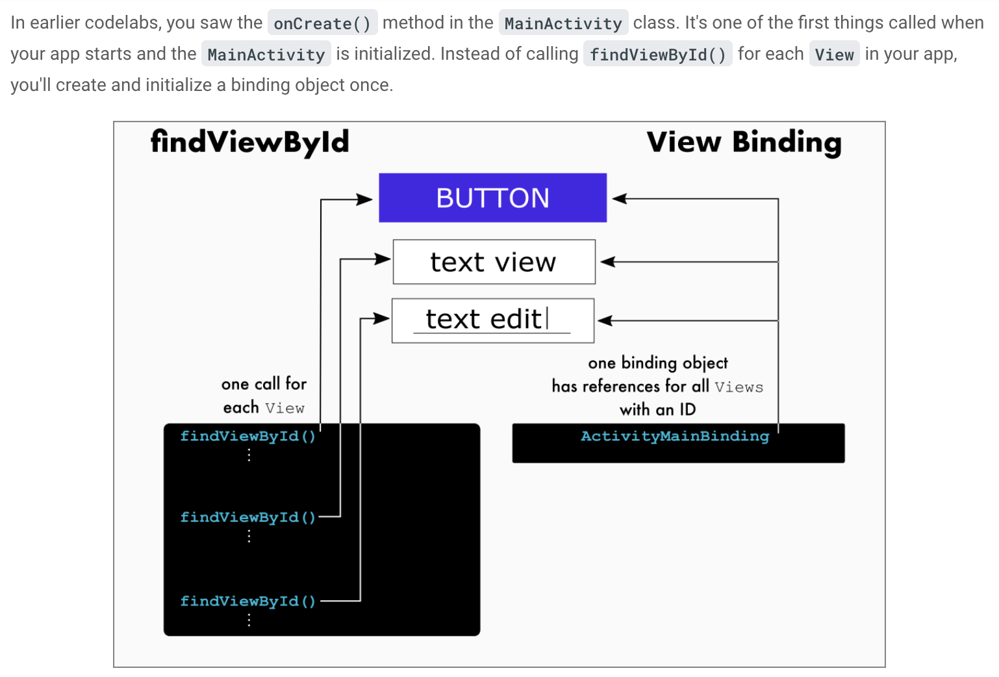

# Questions You Should Be Able to Answer 

## Kotlin 
* What's the difference between a class and abstract class? What's the difference between a class and an interface?
* What is the `vararg` modifier? How is it used?
* What's a primitive? 
* What are scope functions in Kotlin? How many are there?
* Why are some variables/values defined with a leading underscore in their name? (ex: _binding)
* What is property delegation? 
* What is the backing property? When might you use it?
------------------------------------------------------
## Android
* What's android jetpack?
* what's android compose? 
* What's view binding? Why should you use it?
* What's view binding vs data binding?
* What package name is data usually stored in?
* Why is property delegation necessary to define viewModels?
### Coroutines
* What are threads? What is concurrency? Why are threads important for it?
* What does the suspend keyword mean? When do you use it?
* What are the roles of a CoroutineScope, Job, and Dispatcher?
* What is the difference between Deferred and Await?
### RecyclerViews
* What are the 3 parts of a recycler view
* What steps do you need to take to implement a recyclerview
* What is a layout inflater
* When and why should you set a fixed size to your recyclerview?
* What type of width and height should you set for your recyclerview?
### Third Party Library 
* What are libraries that allow you to pull data from the internet?
* What libraries allow you to load image URIs on android devices?
* What's the different between mockk and using something like mockwebserver?
  
---------------------------
## XML
* What are prefixes on XML attributes such as `xmlns` or `app`?
* What should you set the width of an element within a constraint layout?
* What happens if you constrain an elements to a view that has dynamic disability (and this element disappears from the screen?)
* What's the difference between a `style` and a `theme`?


# Answers

## Kotlin
* What's the difference between a class and abstract class? What's the difference between a class and an interface?
> 

* What's a primitive? 
  > A primitive type in coding languages is a type that is either: 1) built into a programming language or 2) one that 
  > could be characterized as the basic structure for building more sophisticated data types. 
  > Another way to think of it is primitive data types can not be broken down into other data types. Integers, floating point numbers, and characters are primitives. 
  > In many languages strings are considered primitives but only because the language has added support for them to be 
  > so since technically strings can be broken down into characters 

* What are scope functions in Kotlin? How many are there?
> Sole purpose is to execute a block of code within the context of a kotlin object. When you call such a method on an object
> the lambda expression provided forms a temporary scope so that you can access the object without its name.
> 
> There are 5 scope functions in kotlin: `let`, `run`, `with`, `apply`, `also`.
> For more on scope functions and when to use each one: https://kotlinlang.org/docs/scope-functions.html#function-selection 

* Why are some variables/values defined with a leading underscore in their name? (ex: _binding)
> If a class has two properties which are conceptually the same but one is part of a public API and another is an 
> implementation detail, use an underscore as the prefix for the name of the private property.

* What is property delegation?
> Property delegation is the process of handing off the getter and setter methods of a variable to another class (known as the delegate class)
> `getter` and `setter` methods are otherwise generated by default for the values they define

## Android
* What's view binding? Why should you use it?
> View binding is a way to select and dynamic adjust elements of a view. You should use it over `findViewById()` because it is less expensive and more scalable. With viewbinding, views are bound to one binding object which contain references to all elements within a few. On the otherhand, using  `findViewById`, you would need to call this method everytime you wanted to adjust ONE element on the screen. If you wanted to adjust another element, you'd need to call this method again. See the image below for more context. 
> 
> View binding also prevents the need for variables associated with the view, saving more space/CPU
```kotlin 
// Old way with findViewById()
val myButton: Button = findViewById(R.id.my_button)
myButton.text = "A button"

// Better way with view binding
val myButton: Button = binding.myButton
myButton.text = "A button"

// Best way with view binding and no extra variable
binding.myButton.text = "A button"
```
* What are the steps for implementing view binding? 
See also: https://developer.android.com/topic/libraries/view-binding?authuser=1
> 1. Add view binding to your gradle file: 
> ```gradle
> android {
>    ...
>    buildFeatures {
>        viewBinding = true
>    }
> }
>```
> 2. Add view binding in the activity class: 
> ```kotlin
> class MainActivity : AppCompatActivity() {
>     private lateinit var binding: ResultProfileBinding  // add this 1
>
>     override fun onCreate(savedInstanceState: Bundle?) {
>         super.onCreate(savedInstanceState)
>         binding = ResultProfileBinding.inflate(layoutInflater)  // add this 2
>         val view = binding.root // add this 3
>         setContentView(view) // add this 4
>     }
> }
>```
  
* What's view binding vs data binding?
> https://developer.android.com/topic/libraries/view-binding#data-binding
* What package name is data usually stored in?
* Why is property delegation necessary to define viewModels?
> Property delegation is necessary for defing view models because if we defined the viewModel variable in the activity in the regular way: 
> ```kotlin
> // in the Activity Class
> private val viewModel = MyViewModelClass() 
> ```
> Then, the app will lose the state held by the viewModel when it goes through configuration changes, completely defeating the purpose of the viewmodel to begin with. 
> Instead, we define it like so: 
> ```kotlin
> private val viewModel: MyViewModelClass by viewModels()
> ```
> This means we've delegated the viewModel value's properties to the `viewModels` class. This delegate class creates 
> the viewModel object for you on first access, retains its value through configuration changes, and returns the value when requested. 
* What is the backing property? When might you use it?
> The backing property is when you need to have a piece of data be mutable within a class but read only outside of that class. 
> To do this you define a `private` `var`, whose name is usually prefixed with an underscore (ex: _myData) and then you 
> also define a `public` `val` in the same class whose getter method returns the var data: 
> ```kotlin
> public class MyDataClass() {
>   private var _myData = 0
> 
>   public val myData: Int
>       get() = _myData
> }
>```
> Now, an instance of the data will be accessible but read only outside of this class.
> 
> Once example of the backing property used in android app is within the viewModel when you want your data available 
> to the UI, but not editable outside the VM

### Coroutines: 
* What are threads? What is concurrency? Why are threads important for it?
> Threads are an abstraction, the smallest unit of code scheduled to run by a program. 
> Concurrency is the ability of an application to run multiple threads (aka "multithreading" or "multitasking"), 
> seemingly out of order to optimize the use of resources. By running code in parallel, the application can continue 
> to do things while wait in other parts for code to execute. 
> 
> This is especially important in android app where we want to keep the UI thread non-blocking. 
> Otherwise the app could become non-responsive
* What does the suspend keyword mean? When do you use it?
> `Suspend` means that the function or code block can be paused or resumed. 
> A function that calls a suspend function must also use the suspend keyword
> 
> The lambdas passed into `async()` and `runBlocking` are suspend functions, but not those functions themselves
* What are the roles of a CoroutineScope, Job, and Dispatcher?
> CoroutineScope = methods that launch coroutines (ex: launch, await) extend this. A context that enforces cancelation and 
> other rules passed down to its children and their children recursively
> 
> Job = A cancelable unit of work with a lifecycle. ex: launch
> 
> Dispatcher = tells the coroutine which thread to run on, removing this responsibility from the dev. 
> Coroutines using Main dispatcher will run on the main thread. Others include Default, IO, Unconfined. 
* What is the difference between Deferred and Await?
> 

### RecyclerView:
* What are the 3 parts of a recycler view
* What steps do you need to take to implement a recyclerview
* What is a layout inflater

* When and why should you set a fixed size to your recyclerview?
> You should set a fixed size to your recyclerview when the data being shown in that recyclerview will not change sizes 
> dynamically. For example, if you are displaying a list of items you've coded into your app then the data source lives 
> in the client side code and will not change dynamically (it will only change if a new item is added to the data source 
> & the app is rebuilt). If you are pulling data from an API however you may not want to set this value 
> (esp if you make the call multiple times in the app's lifecycle or you allow users to pop items off the list). 
> This value is used to improve performance.

* What type of width and height should you set for your recyclerview?
> Be careful with `match_parent`. If you have `match_parent` for the height of a list item and your list is being 
> displayed linearly, the item will take the height of the whole screen. The same issue can happen if you are using a 
> other layout designs.

### Third Party Libraries 
* What are libraries that allow you to pull data from the internet?
> Retrofit, OkHTTP  

* What libraries allow you to load image URIs on android devices?
> Picasso, Glide, and Coil are all libraries that allow you to load image resources. 
> Coil is the newest and gaining popularity because it was written by and for kotlin.
  https://proandroiddev.com/coil-vs-picasso-vs-glide-get-ready-go-774add8cfd40

## XML
* What are prefixes on XML attributes such as `xmlns` or `app`?
> These prefixes are known as namespaces. Namespaces help associate attributes with a given item: XML, android, the app, tools, etc. Namespaces serve two purposes. 1) To distinguish between attributes of the same name and 2) to allow attributes that affect the same space to be grouped together.
* What should you set the width of an element within a constraint layout?
> `match_parent` cannot be used in a constraint layout. Instead, developers should use `0dp` to mean "match the constraints"
  
* What happens if you constrain an elements to a view that has dynamic disability (and this element disappears from the screen?)
> 

* What's the difference between a `style` and a `theme`?
> A style is set of colors, looks, decorations on a view (ex: color of text, boldness, shadows, etc)
> A theme is styling for the entire app, not just ONE view.