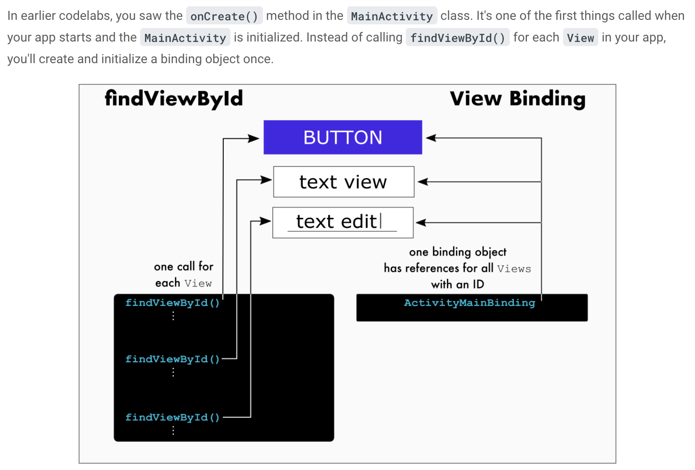

# Questions You Should Be Able to Answer 

## Kotlin 
* What's the difference between a class and abstract class? What's the difference between a class and an interface?
* What is the `vararg` modifier? How is it used?

## Android 
* What's view binding? Why should you use it?  
* What package name is data usually stored in?
  ### RecyclerViews
* What are the 3 parts of a recycler view
* What steps do you need to take to implement a recyclerview
* What is a layout inflater
* Why and When should you set a fixed size to your recyclerview?
* What type of width and height should you set for your recyclerview?

  
## XML
* What are prefixes on XML attributes such as `xmlns` or `app`?
* What should you set the width of an element within a constraint layout?
* What happens if you constrain an elements to a view that has dynamic disability (and this element disappears from the screen?)
* What's the difference between a `style` and a `theme`?


# Answers

## Kotlin
* What's the difference between a class and abstract class? What's the difference between a class and an interface?
> 


## Android
* What's view binding? Why should you use it?
  > View binding is a way to select and dynamic adjust elements of a view. You should use it over `findViewById()` because it is less expensive and more scalable. With viewbinding, views are bound to one binding object which contain references to all elements within a few. On the otherhand, using  `findViewById`, you would need to call this method everytime you wanted to adjust ONE element on the screen. If you wanted to adjust another element, you'd need to call this method again. See the image below for more context. 
  > 
  > View binding also prevents the need for variables associated with the view, saving more space/CPU
  ```kotlin 
  // Old way with findViewById()
  val myButton: Button = findViewById(R.id.my_button)
  myButton.text = "A button"
  
  // Better way with view binding
  val myButton: Button = binding.myButton
  myButton.text = "A button"
  
  // Best way with view binding and no extra variable
  binding.myButton.text = "A button"
  ```
  
* What's view binding vs data binding?

* When and why should you set a fixed size to your recyclerview?
> You should set a fixed size to your recyclerview when the data being shown in that recyclerview will not change sizes dyanmically. For example, if you are displaying a list of items you've coded into your app then the data source lives in the client side code and will not change dynamically (it will only change if a new item is added to the data source & the app is rebuilt). If you are pulling data from an API however you may not want to set this value (esp if you make the call multiple times in the app's lifecycle or you allow users to pop items off the list). This value is used to improve performance.

* What type of width and height should you set for your recyclerview?
> Be careful with `match_parent`. If you have `match_parent` for the height of a list item and your list is being displayed linearly, the item will take the height of the whole screen. The same issue can happen if you are using a other layout designs.  

## XML
* What are prefixes on XML attributes such as `xmlns` or `app`?
  > These prefixes are known as namespaces. Namespaces help associate attributes with a given item: XML, android, the app, tools, etc. Namespaces serve two purposes. 1) To distinguish between attritbutes of the same name and 2) to allow attributes that affect the same space to be grouped together.
* What should you set the width of an element within a constraint layout?
  > `match_parent` cannot be used in a constraint layout. Instead, developers should use `0dp` to mean "match the constraints"
  
* What happens if you constrain an elements to a view that has dynamic disability (and this element disappears from the screen?)
> 

* What's the difference between a `style` and a `theme`?
> A style is set of colors, looks, decorations on a view (ex: color of text, boldness, shadows, etc)
> A theme is styling for the entire app, not just ONE view.