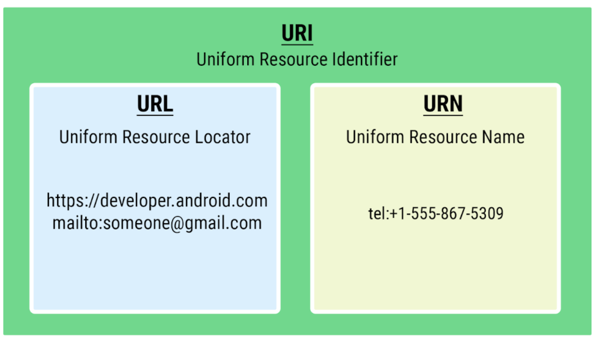

# Vocab 

## A 

### ACTION_VIEW
> A generic intent that takes in a URI. Kdoc calls it "the most common action performed on data -- it is the generic action you can use on a piece of data to get the most reasonable thing to occur"
> Examples of uses include passing a URL for a webview to open, passing a `mailto` or `tel` URI. 

### Adapter 
> An element of code necessary for a recyclerview. The adapter makes view holders and runs operations when those view holders are bound to the parent group. 

## B 

## C 

### Control Flow (Kotlin)
> Control flow is the order in which a computer executes statements in a script. 
> Code is run in order from first line to last line except in structures that change the control flow such as conditionals and loops

### Coroutines (Kotlin)

## D 

## E 

## F 

## G 

## H
### Higher Order Functions 
> passing a function (generally a [lambda](#lambda)) into another function as a parameter 
> functions that return another function are also higher order functions
> ex: `map`, `filter`, `forEach` - these methods all take in a function to perform that operation on a collection
> more ex: `onClickListener`s for android UI elements. 

## I 
### Intents 
> An object representing some action to be performed. There are two types: explicit and implicit. 
> Explicit is specific, usually when you are performing an action (ex: launching an activity) within your app, so you know where the user is going
> Implicit is more abstract, like when you launch a link or another app from your app (ex: email, text, etc). 

## J 

## K 

## L 

### Lambda 
> A function with no name
> ```kotlin
> // ex: 
> myMap.forEach { print("\${it.key} is \${it.value}") }
> ```
See [Higher Order Functions](#higher-order-functions)

### Layout Inflater 
> A **LayoutInfater** class is used to dynamically add views to an android app at runtime. These views are not included in the static XMl of the layout but are instead **added** or **inflated** at runtime.
> <br>
> Usually the layout inflater is defined like so: 
> ```kotlin
> LayoutInflater.from(parent.context)
>   .inflate(@ResInt itemToAttach, parentViewToAttachItemTo, attachToRootBoolean)
> ```
> Where the parentView is usually the recyclerView itself and the attachToRoot bool can be thought of as "do you want to attach this item to the view right now or later?".
* [Android Doc](https://developer.android.com/reference/android/view/LayoutInflater)

## M 
### Menu XML Tags
> the menu resource defines what options are displayed in the app bar, including which icons to use. 
> This resource is defined as its own resource and lives in the `/menu` directory (`res/menu/layout_menu`) like how string values live in `res/values/strings.xml`.
> There are a few different types of menus including and options menu, a popup menu, and a context menu. See [here](https://developer.android.com/guide/topics/ui/menus) for more
> Menus are defined in XML and then inflated in the activity.

## N 

## O 

## P 

## Q 

## R 

## S 

## T 

## U 
### URI 
> Uniform Resource Identifier, more general form of URL. A string of characters used to identify or name a resource
> Protocols include http & ftp
> All URLs are URIs but not all URIs are URLs
> URLs = square, URI = rectangle 
> Other URIs include "tel:1-900-345-6789" or "mailto:email@you.com"
> 

### URL 
> Uniform Resource Locator, a string that turns into a webpage

### URN
> Uniform Resource Name, ex: "tel:1-900-345-6789"

## V

## W 

## X

## Y 

## Z