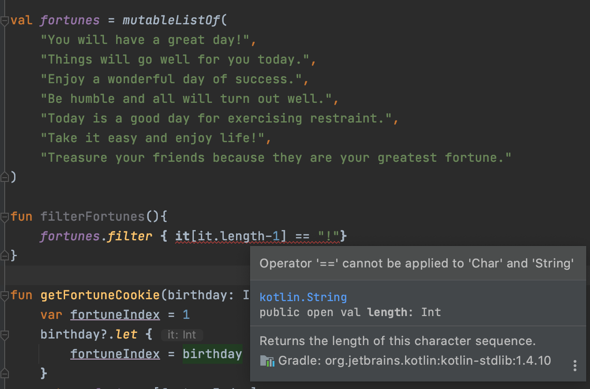

# Kotlin Notes

## Links: 
* Main page: https://developer.android.com/kotlin/learn
And: Kotlin UDemy: https://classroom.udacity.com/courses/ud9011
Goes over kotlin basics, most of it is intuitive, but the takeaways are:

## Syntax 

### val vs var
* `val` used for variable declaration
* `var` means it can be overwritten later

### Quotes 
* single quotes `'` designates characters
* double quotes `"` designates strings 

They *are not* interchangeable. Example: 
```kotlin
// if you have a list of fortunes:
val fortunes = mutableListOf(
  "You will have a great day!",
  "Things will go well for you today.",
  "Enjoy a wonderful day of success.",
  "Be humble and all will turn out well.",
  "Today is a good day for exercising restraint.",
  "Take it easy and enjoy life!",
  "Treasure your friends because they are your greatest fortune."
)
// lets say you want to filter them by ones that end in "!" 
// So you write a filter function:
fun filterFortunes(){
  fortunes.filter { it[it.length-1] == "!"}
}
// since this is markdown, there is no issue but in an actual kotlin file you will see an error (see image).
// the correct way to filter would be: 
fun filterFortunes(){
  fortunes.filter { it[it.length-1] == '!'}
}
```
Incorrect filter image: 


### Type interference
Kotlin can infer the type of a variable so you don’t need to declare it (unless you are declaring a lateinit var)
You’ll still need to use variable types when writing function for:
* The input parameters
* The return type

## Nullability
Kotlin is null safe meaning you can’t set a variable of a certain type to be null directly
i.e. this is wrong:
val myString: String = null
Instead, the type must be nullable so that later you will handle the null:
val myString: String? = null

## Conditionals:
* Work like they do in other languages: if, else if, else
* There is no ternary operator
* “When” block is BAE for clean case statements

When works as if else statement, you don’t even need one parameter to use it:

```kotlin
fun shouldChangeWater(day: string, temp: Int, dirty: Int) : Boolean {
    return when {
        temp > 30 -> true
        dirty > 30 -> true
        day == "Sunday" -> true
        else -> false
    }
}

// the above function is the same (and is interpreted as): 
fun shouldChangeWater(day: string, temp: Int, dirty: Int) : Boolean {
    return if (temp > 30) { 
        true 
    } else if (dirty > 30) {
        true
    } else if (day == "Sunday") {
        true
    } else {
        false
    }
}
```


## Functions:
* Work like other languages
* Need to declare return type
    * Functions in kotlin will always return something (even when they don’t explicitly say they do) the default type is called “Unit” which basically means “no value”.
* Declare with `fun` keyword


### Compile Vs Runtime
```kotlin
val random1 = random()
val random2 = {random()}
```

`random1`: 
* value assigned at compile time
* value never changes when the variable is accessed.

`random2`:
* lambda assigned at compile time 
* the lambda is executed every time the variable is referenced, returning a different value.

### Optional And Default Parameters 
Not every parameter of a functions needs to be passed in everytime. To make an optional parameter, you simply give the parameter a default value. 
```kotlin
fun myDialogBuilder(
    title: String, 
    body: String = "", 
    icon: Int = 0
) {
    dialog.makeDialog() 
        .setTitle(title)
        .setBody(body)
        if ( icon != 0 ){
            this.setIcon(icon)
        }
}
```
In the above example, both body and icon are optional parameters. When we want to call myDialgogBuilder we only **have** to pass in a title component. All of the following calls would be correct: 
```kotlin
myDialogBulder("My Dialog Title") // ex 1
myDialogBulder("My Dialog Title", "My Dialog Body") // ex 2
myDialogBulder(title = "My Dialog Title", icon=R.drawable.my_dialog_icon) // ex 3
myDialogBulder(
    title = "My Dialog Title", 
    body = "My Dialog Body", 
    icon=R.drawable.my_dialog_icon
) // ex 4
```
It is best practice to : 
1) make optional parameters the last parameters of a method 
2) use the parameters name when passing in to a function with an optional params (ex 3 & 4)

### Functions as default parameters:
Instead of assigning a fix value as a default parameter, you can assign a function as a default parameter. 
An example of this could be if you are passing in a value determined by a util function and you are expecting that util to be updated in the future.
```kotlin
//ex 1: you could do this:
fun exampleFun(val1, val2, fixedVal = 30) {
    // do something 
}

//ex 2: or something like this:
val fixedValueFromUtil = getOurDefaultValue()
fun exampleFun(val1, val2, fixedVal = fixedValueFromUtil) {
    // do something 
}
//ex 3: or even this:
fun exampleFun(val1, val2, fixedVal = getOurDefaultValue()) {
    // do something 
}
```
Be careful with example 3. You do not want to use an *expensive* operations as a default parameter (ex: reading files, allocating a lot of memory) as they can really slow down your code. This is because **default parameters are evaluated at call time by kotlin**. This can also lead to out of memory errors. 

### Anonymous Functions aka Lambda:
Functions that don’t have a name. 

But tbh they kinda do bc they have a val that has a name that serves as a reference to the nameless function and to call the function, you call that value passing in the parameters like so:
```kotlin
val stringLengthFunc: (String) -> Int = { input -> 
    input.length
}

val stringLength: Int = stringLengthFunc("Android")
```

But I guess you save some code 🤷🏼‍♀️

```kotlin
// Lambda - a function with no name, always surrounded by curly brackets, still use `()` to invoke it
{ println("Hello") }() 

// you can assign lambdas to a name and then call it like you would a regular function
val sayHello = { println("Hello") }
sayHello()

// you can pass variables into it as such: 
val greeting = "hello friends, my name is Sarah"
val greetFolks = { phrase: String -> println(phrase) }
greetFolks(greeting)

// you can use kotlin's type interference to avoid having to declare the variable type directly
val greetFolks: (String) -> Unit = { phrase -> println(phrase) }
```
The real power of lambda can be seen when you are building "Higher Order Functions" ...

### Higher Order Functions
* Functions that take in other functions as a parameter are called higher order functions.
    * Ex: dialog fragment extension
* If the function being passed in is the last parameter you can often write it as an anonymous lambda function.
* For more on this: https://kotlinlang.org/docs/reference/lambdas.html

```kotlin
// this can be useful when you want to call a certain function in another part of your application
// say you have the following set of functions like so: 

val dirty = 20
fun updateTimeToFeedFish(time: Int) = time + 10 // regular name function
val waterFilter: (Int) -> Int = { count -> count / 2 } // lambda 

// higher order function, taking in an operation function
fun updateDirty(dirty: Int, operation: (Int) -> Int): Int {
    return operation(dirty)
}

// the higher order function can be called in a variety of ways: 
updateDirty(dirty, waterFilter) // pass the function as a param

// if you want to pass a named function into a higher order function 
updateDirty(dirty, ::feedFish)  

// lambda functions can be passed into a higher order function as the last parameter
// in this case you don't need to wrap the lambda in the parens
updateDirty(dirty) { dirty -> 
  dirty / 2 
}

```


### Compact Functions:

Recall it above example `shouldChangeWater` we can write this in many ways

```kotlin
fun shouldChangeWater(day: string, temp: Int, dirty: Int) : Boolean {
    return when {
        temp > 30 -> true
        dirty > 30 -> true
        day == "Sunday" -> true
        else -> false
    }
}
```

One way we could clean this up would be to make each logic check it’s own variable:

```kotlin
fun shouldChangeWater(day: string, temp: Int, dirty: Int) : Boolean {
    val isTooHot = temperature > 30 
    val isDirty = dirty > 30 
    val isSunday = day == "Sunday"
    
    return when {
        isTooHot -> true
        isDirty -> true
        isSunday -> true
        else -> false
    }
}
```
We can use the same idea to *create functions in a single line*: 
```kotlin
fun isTooHot(temperature: Int) = temperature > 30

fun isDirty(dirty: Int) = dirty > 30
```

These single line functions are known as **compact functions**.

#### Compact functions: 
* are a single line function 
* take in one variable 
* do not need to express the return type because it can be inferred

## Arrays
* To create an array: `arrayOf()`
* Elements of the array can be of different types ex: `arrayOf(“fish”, 2)`. Can also have arrays of arrays

## Filters 
Like most languages, kotlin comes with its own out of the box filters for lists and arrays: 
```kotlin
val decorations = listOf("rock", "pagoda", "plastic plant", "alligator", "flowerpot")

println(decorations.filter { true })
// this will print all items of the list

println(decorations.filter { it[0] == 'p' })
// this will print all items of the list that begin with p 
// ie. "pagoda", "plastic plant"
```
### Eager or Lazy Filter: 
Is kotlin's filter method eager or lazy? It's both! 

As an aside, a note on easy vs lazy (from: https://medium.com/javarevisited/eager-is-easy-lazy-is-labyrinthine-b12605f13048)
* **Eager**: an eager algorithm executes immediately and returns a result. 
  * Pros: easier to understand and debug; optimized for single use case (ex `filter`)
* **Lazy**: a lazy algorithm defers computation until it is necessary to execute and then produces a result.
  * Pros: can result in less computation and therefore less garbage (ex `filter`, `map`, `reduce`) 

By default, filter on a list is eager; meaning every time you call filter, it creates a new list with the elements that pass through the filter.

## Loops:
### For
```kotlin
for (i in elements) {

}
```

Can also do something like:
```kotlin
for ((index, element) in elements.withIndex()) {

}
```

### While

### A Note on Loops
Almost everything in kotlin has a value *except* for "for" and "while" loops. What I mean by this is you can not set a for or while loop to a value: 
```kotlin
// the following is INCORRECT and will result in an error: 
val myWrongValue = for (i in elements) { i > 0 }
// also incorrect: 
val thisIsWrong = while (false) {}
```


### Ranges: 
* for looping through quick numbers/letters:
  * `for (i in “a”...”z”)` or
  * `for (i in 1..5)` or
  * `for (i in 5 downTo 1)`
  
## Object Oriented Terminology Overview: 
**Object Oriented Programming (OOP)** is a programming paradigm based on the concept of "objects", which contain data and code. Data within these "objects" is often known as *attributes* or *properties*.

Some Kotlin OOP terms include: 
* **Class** - object blueprint (ex: an aquarium "plan")
* **Object** - instance of a class (ex: an actual aquarium, like Camden)
* **Property** - characteristics of a class (ex: length ot the aquarium)
* **Method** - functionality of the class, i.e. what the object "could do" (ex: fill with water)
* **Interface** - specification that a class can implement (ex: we could have an interface "Clean" that the aquarium class could implement. but other classes can also implement clean)

### Visibility Modifiers:
* **public** - default visibility in kotlin, visible to all
* **private** - only visible inside the file where it lives
* **internal** - only visible within the module

**Module**: A set of kotlin files compiled together

For more, see the [documentation on visibility modifiers](https://kotlinlang.org/docs/visibility-modifiers.html)

### Classes 
```kotlin
class Aquarium {
  // these are properties: 
  val length = 60
  val height = 20 
  val width = 30 
  
  // aquariums generally care about volume for knowing how much water they need
  // we could make a method on this class that calculates the volume: 
  fun volume(): Int {
      return width * height * length 
  }
  
  // But, since the volume will be consistent for a given aquarium, 
  // it makes more sense to have this also be a property value instead of a method
  // this can be done like so:
  val volumeAsProperty: Int
      get() = return width * height * length
  
  // above we are overriding the default getter of this property 
  // we can also override the setter, requiring us to define volume as a var
  var volumeAsProperty2: Int 
    get() = return width * height * length
    set(value) {
        // setters are passed "value" by convention but you can rename it
        // setters need to edit one property, in this example we will change the height 
        height = (value / (width * length))
      // if we wanted to, we could make this setter private
    }
  
}
```
#### Class Visibility: 
* **public**: default, class and public members (any client who sees the class will also see it's members)
* **private**: members are only visible *inside* the class, subclasses can't see private members
* **protected**: members are only visible *inside* the class, but subclasses CAN see
* **internal**: members are visible inside the module

## General / Other Useful Things to Know:
### String manipulation:
Adding variables to strings can be done as such:
“println(“Hello, world! My variable is: $var1”) where var1 is a value. If you need to do some type of expression in order to get the value (ex: convert an int to a string or pull an array element out) then you need to wrap that value in curly braces.

`println(“Hello, world! My variable is: ${var1}”)`